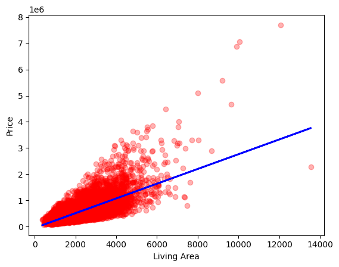

# House Price Prediction using Linear Regression from Scratch

[](https://colab.research.google.com/drive/1FkwxzrLHnKxnye2J-987_WL7RPp0QkQ8?usp=sharing)

## Overview

This project implements **Simple Linear Regression from scratch using Gradient Descent** to predict house prices based on living area.

Instead of relying on machine learning libraries such as Scikit-Learn, the model was built manually to understand the mathematical foundations behind Linear Regression and Gradient Descent.

The project covers the complete machine learning workflow:

- Data Loading
- Data Preprocessing
- Feature Normalization
- Cost Function Implementation
- Gradient Computation
- Gradient Descent Optimization
- House Price Prediction
- Data Visualization

---

## Dataset

The project uses the **House Price India Dataset**.

### Feature Used

- Living Area (Square Feet)

### Target Variable

- House Price

---

## Technologies Used

- Python
- NumPy
- Pandas
- Matplotlib
- Google Colab

---

## Machine Learning Concepts Implemented

### Feature Normalization

The input feature and target values are normalized using standardization:

\[
x_{norm}=\frac{x-\mu}{\sigma}
\]

This helps Gradient Descent converge faster and more efficiently.

---

### Cost Function

Mean Squared Error (MSE) based cost function:

\[
J(w,b)=\frac{1}{2m}\sum_{i=1}^{m}(f_{w,b}(x^{(i)})-y^{(i)})^2
\]

---

### Gradient Descent

Parameters are updated iteratively using:

\[
w := w-\alpha \frac{\partial J}{\partial w}
\]

\[
b := b-\alpha \frac{\partial J}{\partial b}
\]

where:

- \( \alpha \) = Learning Rate
- \( w \) = Weight
- \( b \) = Bias

---

## Results

The model successfully learns the relationship between living area and house price.

### Key Observations

- House price generally increases with living area.
- Living area alone cannot fully explain house prices.
- Additional features such as bedrooms, bathrooms, floors, and location would improve prediction accuracy.

---

## Visualizations

### Regression Line vs Actual Data

```markdown

```

### Gradient Descent Convergence

```markdown

```

---

## Sample Prediction

```text
Enter Size of house in Sq. Ft: 2000

Predicted House Price:
₹XXXXXXXX
```

---

## Repository Structure

```text
House-Price-Prediction-Linear-Regression/
│
├── HousePricePrediction.ipynb
├── README.md
│
└── images/
    ├── regression_plot.png
    └── cost_vs_iterations.png
```

---

## What I Learned

Through this project, I gained hands-on experience with:

- Linear Regression
- Gradient Descent
- Feature Scaling
- Cost Functions
- Data Visualization
- Machine Learning Fundamentals

Most importantly, I learned how Linear Regression actually works behind the scenes instead of treating machine learning models as a black box.

---

## Future Improvements

- Multiple Linear Regression
- Train/Test Split
- R² Score Evaluation
- RMSE and MAE Metrics
- Feature Engineering
- Model Comparison with Scikit-Learn

---

## Run the Notebook

Open directly in Google Colab:

https://colab.research.google.com/drive/1FkwxzrLHnKxnye2J-987_WL7RPp0QkQ8?usp=sharing

---

## Author

**Prakhar Tagra**

GitHub:
https://github.com/PrakharTagra

Repository:
https://github.com/PrakharTagra/House-Price-Prediction-Linear-Regression